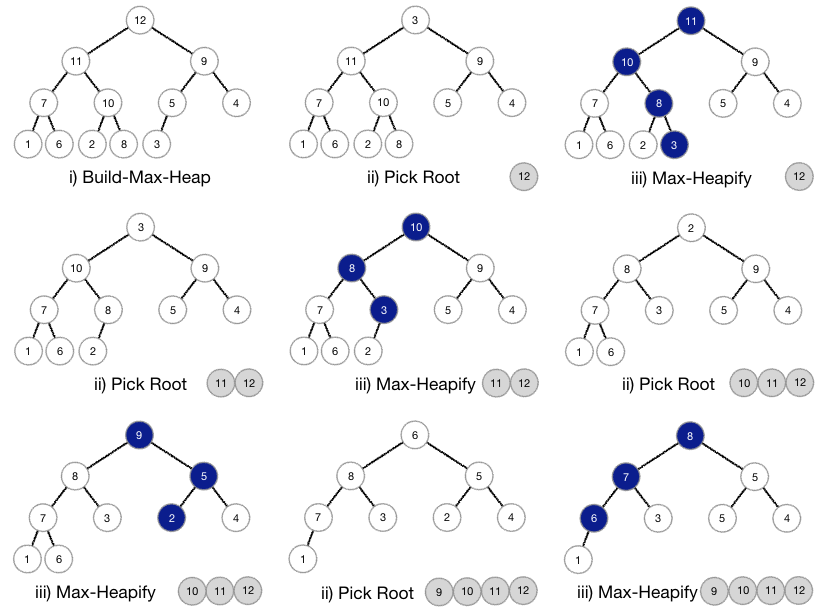

## Sorting

### Insertion Sort
Simple sorting algorithm that works similar to sorting a deck of cards in your hands.
The array is "split" into a sorted and unsorted part, such that values from the unsorted part are picked
one by one and placed at the correct position in the sorted part.

  

* Iterate from second element to end of array
* Compare the current element to the predecessor
* If it is smaller, compare it to the elements before the predecessor and move the greater elements 
to the right to make space
  

  

* Time Complexity: **O(n^2^)** 
* Space Complexity: **O(1)** 
* Sorting in-place: **Yes** 
* Stable: **Yes**
  

> Insertion Sort is useful on arrays with small amounts of elements or when the input array is almost sorted.

**More on Insertion Sort**
* [Programiz](https://www.programiz.com/dsa/insertion-sort)
* [MyCodeSchool](https://youtu.be/i-SKeOcBwko) (Video)

---
### Merge Sort
Merge Sort is a divide and conquer algorithm which divides the input array into
two halves, calls itself for these two halves and merges the sorted arrays.
The `merge()` function is used for merging two sorted halves.

* Find the middle point to divide the array
* Call `mergesort()` on left half
* Call `mergesort()` on right half
* Call `merge()` on the two sorted halves

  

* Time Complexity: **O(n log n)** 
* Space Complexity: **O(n)** 
* Sorting in-place: **No**
* Stable: **Yes**
  

> Merge Sort is useful for sorting Linked Lists as we can complete the `merge()` operation without extra space.
> It is also used for large amounts of data like in [External Sorting](https://en.wikipedia.org/wiki/External_sorting).

**More on Merge Sort**
* [Programiz](https://www.programiz.com/dsa/merge-sort)
* [Simple Snippets](https://youtu.be/cAv-4ltj1go) (Very in-depth video)
* [MyCodeSchool](https://youtu.be/TzeBrDU-JaY) (Video)
* [Jenny's Lectures](https://youtu.be/jlHkDBEumP0) (Video)

---

### Quick Sort
Quick Sort is a divide and conquer algorithm that picks a so-called pivot-element and partitions
the given array around this element. As a result, there are different versions of Quick Sort that
pick the pivot-element in different ways.
1. Always pick first element
2. Always pick last element
3. Pick a random element
4. Pick the median

The key process is the `partition()` function. The point of this function is to take a
pivot-element `p` of an array `arr` and put `p` at the correct position in the sorted array
such that all elements before `p` are smaller and all elements after are greater.

  

* Time Complexity: **O(n^2) worst case, O(n log n) average case**
* Space Complexity: **O(log n)**
* Sorting in-place: **Yes**
* Stable: **No**
  

> The time complexity will vary depending on the choice of the pivot-element. 
> Although O(n^2) is the worst case, QuickSort is faster in practice.

> Randomized Quick Sort works well in practice and has a better space complexity than Merge Sort.

**More on Quick Sort**
* [Programiz](https://www.programiz.com/dsa/quick-sort)
* [Simple Snippets](https://youtu.be/yEzFMbc7ltQ) (Very in-depth video)
* [MyCodeSchool](https://youtu.be/COk73cpQbFQ) (Video)

---

### Heap Sort
Comparison-based sorting technique based on the 
[Binary Heap](https://github.com/ybrenning/algodat_practice/tree/master/data_structures/priority_queues) 
data structure. It is similar to Selection Sort in that we repeatedly find the minimum element and place it at
the beginning. We can modify a complete Binary Tree to a Max-Heap by running a `heapify()` function on all non-leaf
nodes of the heap.

* Build a max heap from the input data
* At this point, the largest item is stored at the root. Replace it with the last item of the heap and reduce the size
of the heap by 1.
* Re-heapify the root of the tree
* Repeat the last two steps while the size of the heap is greater than 1

  

* Time complexity: **O(n log n)**
* Space complexity: **O(1)**
* Sorting in-place: **Yes**
* Stable: **No**
  

> Heap Sort is widely used due to its simplicity, consistency and efficient space- and time complexities.

**More on Heap Sort**
* [Programiz](https://www.programiz.com/dsa/heap-sort)
* [Simple Snippets](https://youtu.be/XrY8z4e5HAk) (In-depth video)
