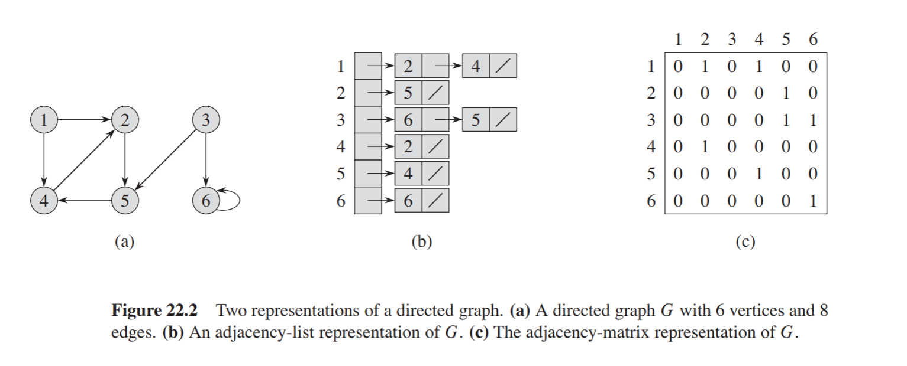

## Graphs
A graph is an abstract, non-linear data structure consisting of
a finite set of `vertices` and `edges`. 

Graphs are commonly implemented using adjacency matrices or 
adjacency lists.

### Adjacency Matrix
A two-dimensional matrix of which the rows represent source
vertices and the columns represent destination vertices.

**Characteristics**
Time complexities:
* Add vertex: **O(|V|^2)**
* Remove vertex: **O(|V|^2)**
* Add edge: **O(1)**
* Remove edge: **O(1)**
* Find edge: **O(1)**

Space complexity: **O(|V|^2)** 

### Adjacency List
Vertices are stored as records or objects, and every vertex stores
its own list of adjacent vertices. This allows for an additional
storage of data on the vertices.

**Characteristics**
Time complexities:
* Add vertex: **O(1)**
* Remove vertex: **O(|E|)**
* Add edge: **O(1)**
* Remove edge: **O(|V|)**
* Find edge: **O(|V|)**

Space complexity: **O(|V| + |E|)**

**More on Graphs**
* [GeeksForGeeks](https://www.geeksforgeeks.org/graph-and-its-representations/)
* [freeCodeCamp](https://youtu.be/09_LlHjoEiY) (Video)
* [Implementation using adjacency matrix](https://youtu.be/nvRkFi8rbOM)
* [Implementation using adjacency list](https://youtu.be/LG_KDNd5BQI)