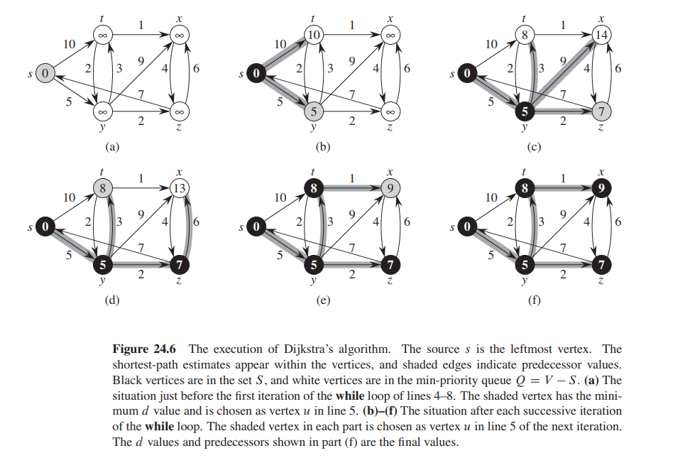

# Dijkstra's Algorithm

Dijkstra's algorithm solves the single-sourced shortest paths problem
on a weighted, directed graph $G = (V, E)$ for the case in which all edge weights
are non-negative.

Dijkstra’s algorithm maintains a set S of vertices whose final shortest-path
weights from the source s have already been determined. The algorithm repeatedly selects the vertex u from the
unvisited vertices with the minimum shortest-path estimate, adds u
to S, and relaxes all edges leaving u.

