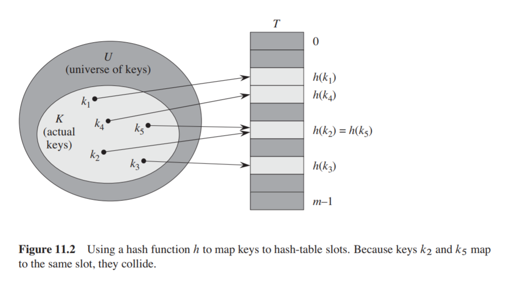
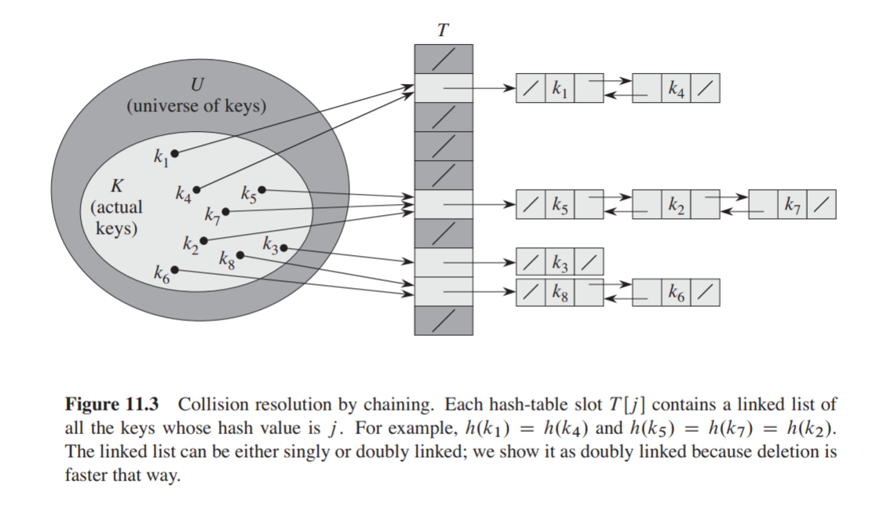
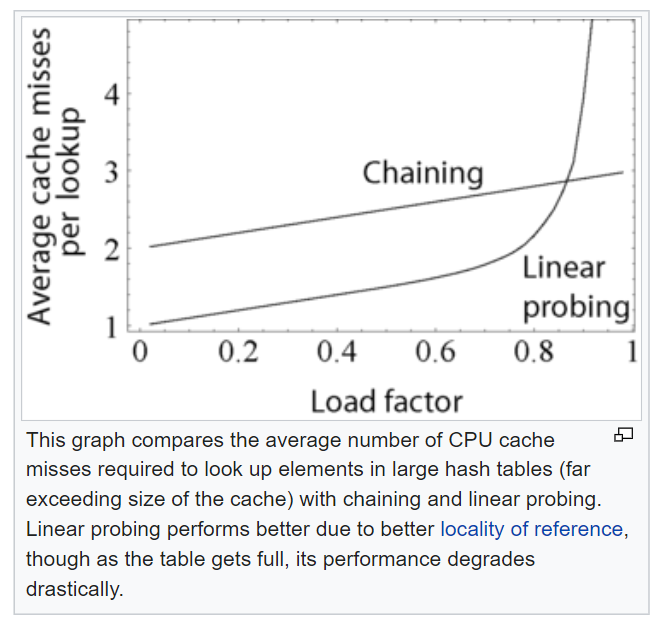

## Hash Tables
A hash table is a data structure that maps keys to values.
It uses a hash function to compute an index, also called a _hash code_
into an array of slots from which the desired value can be found.
During lookup, the key is hashed and the result determines where
the corresponding value is stored.

Ideally, the hash function assigns each key to a unique slot.
In practice, most hash table designs employ an imperfect hash function,
meaning _collisions_ are possible (when the hash function calculates
the same hash for different keys). Such collisions can be resolved
in different ways.

"The advantage of using hashing is that the table address of a record can be directly computed from the key. 
Hashing implies a function $h$, when applied to a key $k$, produces a hash $M$. 
However, since $M$ could be potentially large, the hash result should be mapped to finite entries in the 
hash table—or slots—several methods can be used to map the keys into the size of hash table $N$. 
The most common method is the division method, in which modular arithmetic is used in computing the slot." \
_Source: Wikipedia_

This is often done in two steps, \
$Hash = Hash-Function(Key)$ \
$Index = Hash \mod Hash-Table-Size$

Searching a hash table typically consists of two parts.
The first part is computing a hash using the hash function.
The ideal case is that no two keys hash to the same index, however
this is theoretically impossible, meaning there will always be the possibility
for collisions when indexing, hence the second part of the algorithm.

The two common methods for collision resolution are chaining and open addressing.

In open addressing, the hashed-to slot is examined and proceeds in a 
_probe sequence_ until an unoccupied slot is found for insertion.

In my Python and C implementations, I have used linear probing to handle collisions.

### Characteristics
Time complexities:
* Accessing elements: N/A
* Finding elements: **$O(n)$** ($O(1)$ average and amortized)
* Insertion/Deletion: **$O(n)$**

Space complexity: **$O(n)$**

> In a well-dimensioned hash table, the average cost for each lookup is independent
> of the number of elements stored in the table. Hash Tables have the advantage of
> an $O(1)$ average lookup speed, making them preferable for accessing elements efficiently. 

**More on Hash Tables:**
* [Wikipedia](https://en.wikipedia.org/wiki/Hash_table)
* [MIT](https://en.wikipedia.org/wiki/Hash_table) (Video)
* [Harvard](https://youtu.be/nvzVHwrrub0) (Video)
* [Implementation in C](https://youtu.be/wg8hZxMRwcw) (Video)
