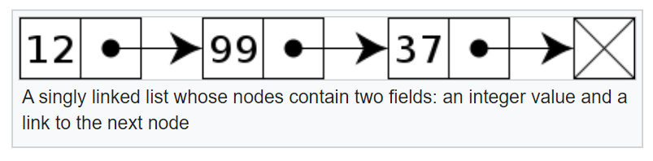
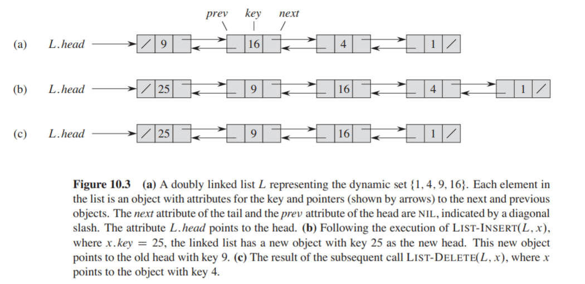

## Linked Lists
A linked list is a linear data structure which stores elements at non-contiguous memory locations,
unlike [Arrays](https://github.com/ybrenning/algodat_practice/tree/master/data_structures/arrays).
The elements (nodes) in a linked list are linked using "pointers" in a sequential form. 

### Singly Linked Lists
In its most basic form, each node contains two fields: data, and a link to the next node.

### Doubly Linked Lists
In a doubly linked list, each node contains a second link field pointing to the previous node in the sequence.
In Java for instance, Linked Lists are implemented using Doubly Linked Lists with `LinkedList<>`.

### Characteristics
Time complexities:
* Accessing elements: **O(n)**
* Finding elements: **O(n)**
* Insertion/Deletion: **O(1)**

Space complexity: **O(n)**

> Linked lists offer dynamic sizing as well as ease of insertion and deletion. On the other hand, random access
> is not possible the way it is in arrays. Another disadvantage is the extra storage needed for references.

**More on Linked Lists:**
* GeeksforGeeks
  * [Singly Linked Lists](https://www.geeksforgeeks.org/linked-list-set-1-introduction/)
  * [Doubly Linked Lists](https://www.geeksforgeeks.org/doubly-linked-list/)
* MyCodeSchool
  * [Introduction](https://www.youtube.com/watch?v=NobHlGUjV3g&list=PL2_aWCzGMAwI3W_JlcBbtYTwiQSsOTa6P&index=3&ab_channel=mycodeschool)
  * [Arrays vs Linked Lists](https://www.youtube.com/watch?v=lC-yYCOnN8Q&list=PL2_aWCzGMAwI3W_JlcBbtYTwiQSsOTa6P&index=4&ab_channel=mycodeschool)
  * [Linked List Implementation](https://www.youtube.com/watch?v=vcQIFT79_50&list=PL2_aWCzGMAwI3W_JlcBbtYTwiQSsOTa6P&index=5&ab_channel=mycodeschool)
  * [Doubly Linked List Implementation](https://www.youtube.com/watch?v=VOQNf1VxU3Q&list=PL2_aWCzGMAwI3W_JlcBbtYTwiQSsOTa6P&index=13&ab_channel=mycodeschool)
