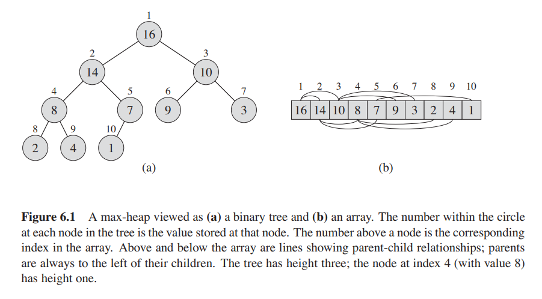

## Priority Queues
A priority queue is an abstract data type similar to a queue in which each element
additionally has a priority associated with it. An element with a high priority
is "served"/dequeued before an element with a lower priority.

Generally, heaps are preferred for priority queue implementations, however
priority queues are conceptually distinct from heaps. A priority queue is
a concept similar to a "list" or a "map". Just like we can implement a 
list using an array or a linked list, we can implement priority queues
with a variety of other methods such as unordered arrays.

In my Python and C implementations, I have used a heap to implement this data type.

### Heaps
A heap is a complete binary tree that satisfies the so-called _heap property_ :
* any given node is always greater than its child nodes, meaning the root is the largest
  (**max heap property**)
* any given node is alwasy smaller than its child nodes, meaning the root is the smallest
  (**min heap property**)

### Characteristics
Time complexities:
* Accessing min/max: **$O(1)$**
* Insertion/Deletion: **$O(\log n)$**

Space complexity: **$O(n)$**

**More on heaps**
* [Programiz](https://www.programiz.com/dsa/heap-data-structure)
* [NoobCoder](https://youtu.be/hkyzcLkmoBY) (Video)
* [Simple Snippets](https://youtu.be/86mQ1gD3Zgg) (Video)

> Heaps are useful for implementing priority queues and in algorithms such as
> Dijkstra's algorithm and [Heap Sort](https://github.com/ybrenning/algodat_practice/tree/master/algorithms/sorting).
