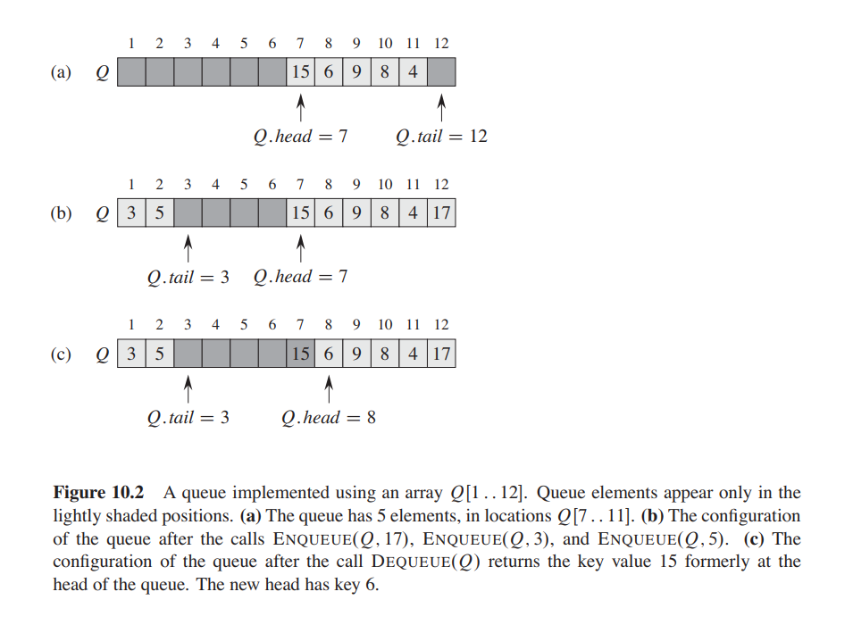

## Queues
A queue is a linear structure which follows the FIFO (First in first out) order.
It is an abstract data type that is maintained in a sequence and can be 
modified by the addition of entities at one end of the sequence and the
removal of entities from the other end of the sequence.

Queues are used in processes where things do not have to be handled
immediately, but can be  processed in FIFO order such as Breadth First Search.
This is particularly helpful in the following scenarios:

1. When a resource is shared among multiple consumers, such as CPU scheduling
2. When data is asynchronously transferred between processes

### Characteristics
Time complexities:
* Accessing elements (peek) **O(1)**
* Insertion/Deletion: **O(1)**

Space complexity: **O(n)**

> Queues may be implemented using linear data structures such as arrays or linked lists.
