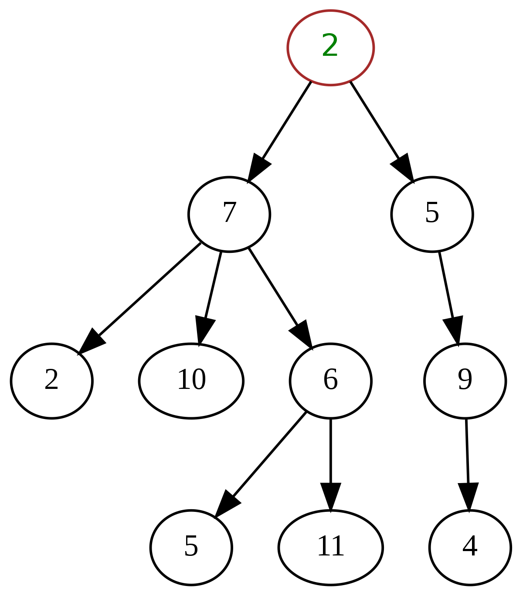

## Trees
A tree is an abstract, non-linear data structure with a root node and subtrees
of children with parents, represented as a hierarchical set of linked nodes.

### Terminology
**Neighbor**: Parent or child. \
**Ancestor**: A node reachable by repeated proceeding from child to parent. \
**Descendant**: A node reachable by repeated proceeding from parent to child. Also known as subchild. \
**Degree**: For a given node, its number of children. A leaf has necessarily degree zero. \
**Degree of tree**: The degree of a tree is the maximum degree of a node in the tree. \
**Distance**: The number of edges along the shortest path between two nodes. \
**Level**: The level of a node is the number of edges along the unique path between it and the root node. \
**Width**: The number of nodes in a level. 
**Breadth**: The number of leaves. \
**Forest**: A set of $n \geq 0$ disjoint trees. \
**Ordered tree**: A rooted tree in which an ordering is specified for the children of each vertex. \
**Size of a tree**: Number of nodes in the tree.

> The _height_ of a node is the length of the longest downward path to a leaf from that node. 
> The height of the root is the height of the tree. The _depth_ of a node is the length of the path to its root 
> (i.e., its root path). This is commonly needed in the manipulation of the various self-balancing trees, 
> AVL Trees in particular. The root node has depth zero, leaf nodes have height zero, and a tree with only 
> a single node (hence both a root and leaf) has depth and height zero. Conventionally, an empty tree 
> (tree with no nodes, if such are allowed) has height −1.

_Source: Wikipedia_

**More on Trees**
* [Wikipedia](https://en.wikipedia.org/wiki/Tree_(data_structure))
* [MyCodeSchool](https://youtu.be/qH6yxkw0u78)
