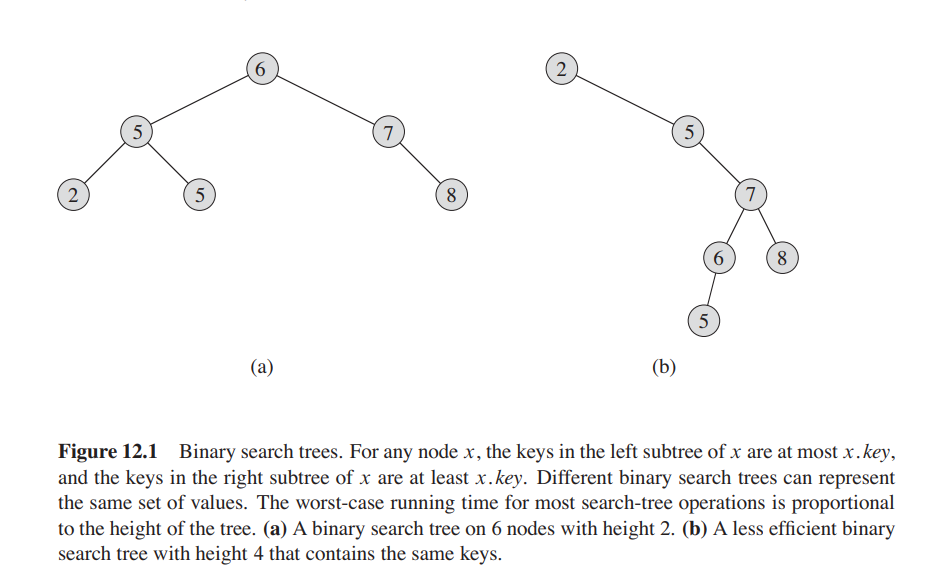

## Binary Search Trees
A binary search tree is a rooted binary tree data structure where each node stores
a key greater than all keys within the left subtree and lesser than all keys
within the right subtree.

### Characteristics
Time complexities
* Finding element: **O(h)**, where _h_ is the height of the tree
* Insertion/deletion: **O(h)**, where _h_ is the height of the tree

Space complexity: **O(n)**

> To keep the height _h_  low, we can use self-balancing BSTs such as AVL Trees
> and Red Black Trees. These maintain a height of log n and therefore all of the 
> complexities above become **O(log n)**.

**More on Binary Search Trees**
* [Wikipedia](https://en.wikipedia.org/wiki/Binary_search_tree)
* [Programiz](https://www.programiz.com/dsa/binary-search-tree)
* MyCodeSchool
  * [Introduction](https://youtu.be/pYT9F8_LFTM)
  * [Implementation in C](https://youtu.be/COZK7NATh4k)
